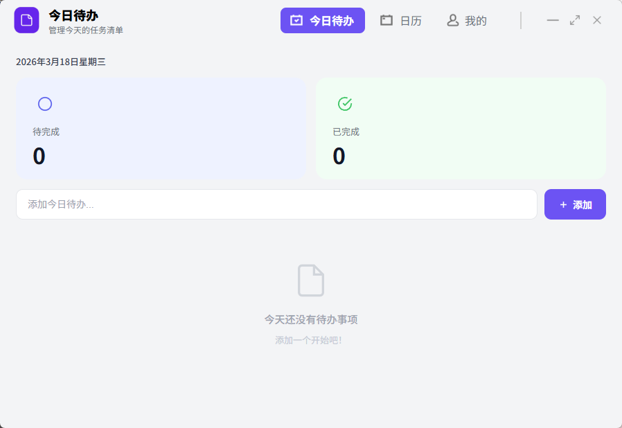
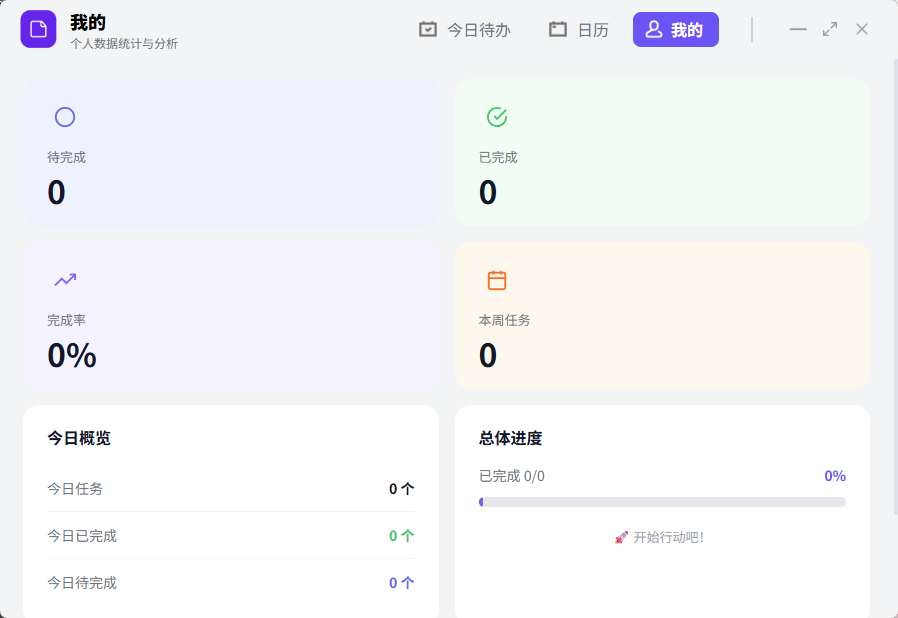

# MyTodoList

> 一款简洁优雅的桌面待办事项管理应用，帮助你高效规划每一天。

---

## 功能介绍

### 今日待办
- 查看和管理当天的任务清单
- 快速添加、完成、删除待办事项
- 专注当下，清晰掌握今日进度

### 日历视图
- 以日历形式浏览不同日期的待办事项
- 直观查看历史任务与未来计划
- 支持跨日期任务管理

### 我的
- 个人数据统计与分析
- 查看任务完成率与习惯趋势

---

## 技术栈

| 技术 | 说明 |
|------|------|
| [Electron](https://www.electronjs.org/) | 跨平台桌面应用框架 |
| [Vue 3](https://vuejs.org/) | 前端框架，Composition API |
| [Vite](https://vitejs.dev/) | 构建工具 |
| [electron-vite](https://electron-vite.org/) | Electron + Vite 整合方案 |
| [Vue Router](https://router.vuejs.org/) | 前端路由 |
| [Pinia](https://pinia.vuejs.org/) | 状态管理 |
| SCSS | 样式预处理器 |

---

## 截图展示

> 应用采用简洁的顶部导航栏设计，支持今日待办、日历、我的三大模块切换，激活菜单高亮显示。





---

## 本地开发

```bash
# 安装依赖
npm install

# 启动开发环境
npm run dev

# 打包构建
npm run build
```

---

## 项目结构

```
src/
├── main/           # Electron 主进程
├── preload/        # 预加载脚本
└── renderer/       # 渲染进程（Vue 应用）
    ├── public/     # 静态资源（图片等）
    └── src/
        ├── assets/
        ├── components/   # 公共组件
        ├── router/       # 路由配置
        ├── stores/       # Pinia 状态
        ├── utils/        # 工具函数
        └── views/        # 页面视图
```

---

## 系统要求

- Windows 10 及以上
- 安装包大小约 400MB（含 Electron 运行时）

---

## License

MIT
